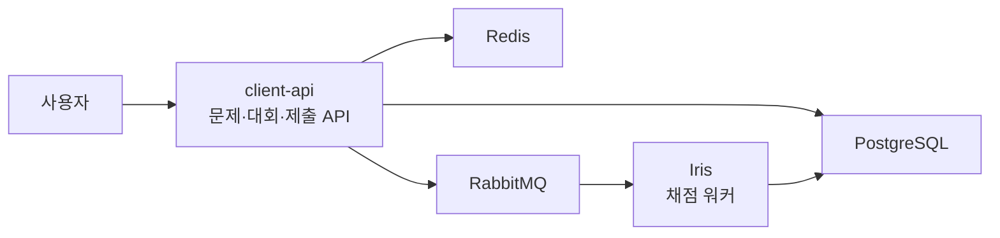

# Project Overview

## Codedang client-api 장애 원인 가설 검증 AI Agent

> Codedang의 `client-api`와 직접 연관된 Kubernetes 워크로드에서 장애 증거를 수집하고, 원인 가설을 검증하는 읽기 전용 RCA(Root Cause Analysis) Agent

## 1. 프로젝트 배경

[Codedang](https://github.com/skkuding/codedang)은 SKKUding 팀이 개발·운영하는 오픈소스 Online Judge 시스템이다. 사용자는 웹에서 문제를 풀고 코드를 제출하여 채점 결과를 확인할 수 있다.

이 프로젝트의 분석 진입점인 [`client-api`](https://github.com/skkuding/codedang/tree/main/apps/backend/apps/client)는 문제·대회·사용자·제출 요청을 처리하는 사용자용 백엔드 API다. Kubernetes에서는 여러 Pod로 실행되며 PostgreSQL, Redis, RabbitMQ와 통신한다. 코드 제출은 RabbitMQ를 거쳐 채점 워커인 Iris에서 처리된다.



위 그림은 이 프로젝트와 관련된 흐름만 단순화한 것이다. Codedang 전체 구조를 분석 대상으로 삼지는 않는다.

관련 코드와 인프라는 다음 저장소에서 확인할 수 있다.

- [Codedang 저장소](https://github.com/skkuding/codedang)
- [client-api 소스 코드](https://github.com/skkuding/codedang/tree/main/apps/backend/apps/client)
- [client-api Kubernetes 구성](https://github.com/skkuding/codedang/tree/main/infra/k8s/client-api)
- [RabbitMQ 구성](https://github.com/skkuding/codedang/tree/main/infra/k8s/rabbitmq)
- [Iris 채점 워커](https://github.com/skkuding/codedang/tree/main/apps/iris)

## 2. 문제와 목적

`client-api`에서 5xx, 응답 지연, Pod 재시작 또는 채점 지연이 발생해도 원인이 `client-api` 자체에 있다고 단정할 수 없다.

- 새 버전의 설정이나 코드가 잘못되었을 수 있다.
- Pod가 OOM으로 종료되거나 Probe에 실패했을 수 있다.
- Redis 또는 RabbitMQ 연결에 문제가 생겼을 수 있다.
- 제출 흐름에서는 RabbitMQ나 Iris에서 병목이 발생했을 수 있다.
- 정상 배포 직후 별개의 인프라 문제가 발생했을 수도 있다.

운영자는 원인을 찾기 위해 Loki, Prometheus, Kubernetes, Argo CD와 Git을 오가며 장애 시점의 데이터를 직접 맞춰야 한다.

이 프로젝트의 목적은 다음과 같다.

> **여러 도구와 워크로드에 흩어진 장애 증거를 자동으로 수집·정렬하고, 원인 후보를 지지하거나 기각하여 운영자의 초기 장애 분석 시간을 줄인다.**

이 프로젝트는 로그 수집 플랫폼이나 자동 복구 시스템을 만들지 않는다. 기존 관측 시스템의 데이터를 조회하여 다음 질문에 답하는 조사 Agent를 만든다.

1. 현재 증상을 설명할 수 있는 원인 후보는 무엇인가?
2. 후보를 지지하거나 반박하는 증거는 무엇인가?
3. 어떤 후보를 기각할 수 있는가?
4. 다음으로 무엇을 확인하거나 조치해야 하는가?

## 3. 분석 대상

### 항상 분석

- `client-api`의 모든 Pod와 이전 컨테이너
- Pod·Deployment·ReplicaSet·Kubernetes Event
- 장애 전후 로그와 핵심 메트릭
- `client-api`의 배포 revision, 이미지 digest, Git commit·diff

### 증상에 따라 추가 분석

| 증상 | 추가 워크로드 |
|---|---|
| Redis 연결·캐시 오류 | Redis |
| 메시지 발행·큐 지연 | RabbitMQ |
| 제출·채점 지연 | RabbitMQ와 Iris |

관련 워크로드는 자동으로 탐색하지 않고 명시적인 allowlist로 관리한다. 전체 클러스터를 조회하지 않고 `client-api`에서 직접 이어지는 1-hop 범위까지만 분석한다.

PostgreSQL처럼 Kubernetes 외부에 있는 시스템은 별도의 실시간 연동을 만들지 않는다. 사용할 수 있는 메트릭이나 과거 장애 자료가 있으면 Incident Bundle의 증거로 입력한다.

## 4. 확인할 증거

모든 로그를 LLM에 전달하지 않는다. 장애 시점과 가설에 필요한 데이터만 조회하고 구조화한다.

| 출처 | 확인 내용 |
|---|---|
| Loki | 예외, 5xx, timeout, DB·Redis·RabbitMQ 연결 오류, 이전 컨테이너 로그 |
| Prometheus | 요청량, 에러율, p95 지연시간, CPU·메모리, throttling, 재시작, RabbitMQ 큐 상태 |
| Kubernetes API | Pod 상태, 종료 사유, OOMKilled, Probe 실패, Event, Deployment·ReplicaSet |
| Argo CD·Registry | 배포 시각, revision, 이미지 digest |
| Git | 배포 이미지와 연결된 commit 및 diff |

각 조회 결과에는 시간, 출처, 대상 리소스와 원본을 찾을 수 있는 증거 ID를 부여한다. Secret 값과 개인정보·토큰은 수집하지 않거나 LLM 전달 전에 마스킹한다.

## 5. Agent 동작

사용자가 장애 시각과 증상을 입력하면 Agent가 분석을 시작한다.

```text
장애 정보 입력
  → client-api의 초기 ±15분 데이터 조회
  → 증거 타임라인 구성
  → 원인 가설 최대 3개 생성
  → 가설에 따라 관련 워크로드 추가 조회
  → 지지 근거와 반증 비교
  → 후보 기각·채택·순위화
  → RCA 보고서 생성
```

증거가 부족하면 조회 시간 범위를 확장한다. 시간 계산, 수치 비교, 파싱과 정렬은 일반 코드가 담당하고, LLM은 가설 생성, 다음 도구 선택, Git diff 해석과 보고서 작성을 담당한다.

판정은 네 단계로 제한한다.

- `후보`: 추가 검토가 필요한 가설
- `유력`: 여러 증거가 지지하고 주요 반증이 없는 상태
- `확정`: 기존 사후 분석, 격리 환경 재현 또는 롤백 결과로 확인된 상태
- `판단 불가`: 증거가 부족하거나 충돌하는 상태

읽기 전용 분석에서는 원칙적으로 `유력`까지만 제시한다. 수치형 신뢰도는 별도로 보정할 수 없으므로 사용하지 않는다.

## 6. 6주 MVP

| 구분 | 범위 |
|---|---|
| 실행 방식 | 수동 CLI 입력 |
| 분석 진입점 | `client-api` |
| 관련 워크로드 | Redis, RabbitMQ, Iris allowlist |
| 데이터 | Loki, Prometheus, Kubernetes, Argo CD, 이미지 digest, Git |
| 분석 범위 | 초기 ±15분, 증거 부족 시 확장 |
| 원인 후보 | 최대 3개 |
| 출력 | 증거 ID가 포함된 Markdown·JSON 보고서 |
| 권한 | 운영 환경을 변경할 수 없는 read-only |

Alertmanager 자동 연동, Tempo Trace, 웹 UI와 자동 복구는 MVP에서 제외한다. k6는 성능 분석 기능이 아니라 격리 환경에서 트래픽을 만드는 평가 도구로만 사용한다.

## 7. 평가

### 통제된 재현

정량 평가는 운영 시스템과 의존성을 공유하지 않는 전용 테스트 환경에서 수행한다.

1. `client-api` 메모리 제한으로 인한 OOMKilled
2. 잘못된 환경변수로 인한 시작 실패
3. Readiness Probe 오류
4. RabbitMQ 또는 모의 의존 서비스 장애
5. 정상 배포 후 별도 부하 발생

조건과 노이즈를 바꾼 최소 12개의 Incident Bundle을 만들고, 일부는 개발에 사용하지 않는 평가 세트로 분리한다. Agent에는 장애 주입 스크립트와 Ground Truth를 제공하지 않는다.

### 과거 장애 사례

- 5월 대회 중 발생한 장애
- `release` 배포 과정에서 발생한 장애

승인받아 익명화한 데이터가 남아 있는 사례만 분석한다. 기존 사후 분석과 Agent의 결론·근거를 비교하되, 정답이나 증거가 불명확한 부분은 추정하지 않는다. 과거 사례는 정량 평가에 섞지 않고 별도 사례 연구로 작성한다.

## TODO

| 주차 | 목표 | 산출물 |
|---|---|---|
| 1 | Codedang 구조·데이터 접근 확인, Incident Bundle과 격리 환경 설계 | 분석 범위와 시나리오 명세 |
| 2 | client-api의 Loki·Prometheus·Kubernetes 조회 구현 | 구조화된 기본 증거 |
| 3 | 관련 워크로드 조회, Argo CD·이미지·Git 연결 | 증거 타임라인과 재현 시나리오 |
| 4 | 가설 생성·추가 조회·채택/기각 구현 | Agent MVP와 보고서 |
| 5 | 12개 이상 Incident Bundle 평가, 가능한 과거 사례 분석 | 비교 결과와 실패 사례 |
| 6 | 오류 처리 개선, CLI 데모와 문서 정리 | 재현 가능한 최종 결과물 |

## 참고 프로젝트

[KubeRCA](https://github.com/kube-rca/kuberca)의 Kubernetes context 조회와 읽기 전용 분석 구조를 참고한다. 본 프로젝트는 Codedang의 `client-api`와 직접 연관된 워크로드, Loki·Argo CD·Git 증거 연결과 가설 검증에 범위를 맞춰 독립적으로 구현한다.
